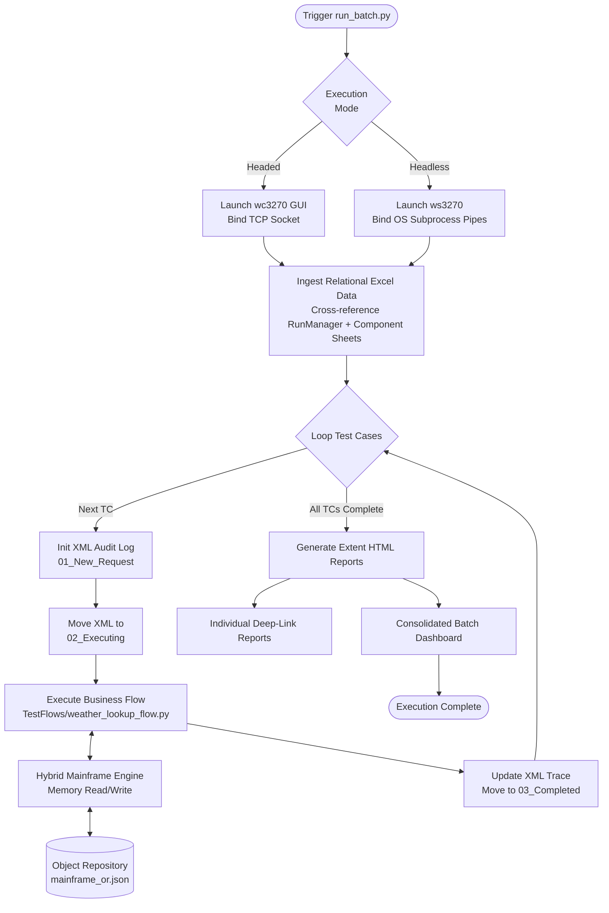
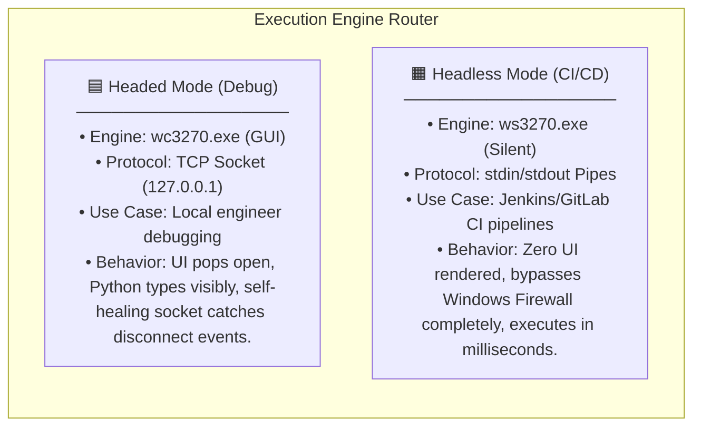
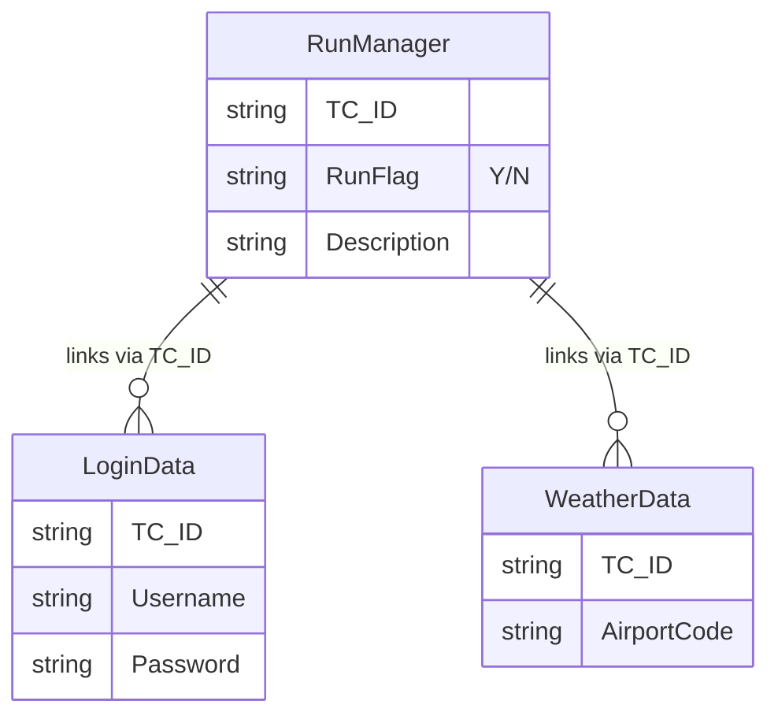

# Jarvis-Replica Python Mainframe Framework
## Detailed Design Record (DDR) — Architecture & Flow Documentation

> **Audience:** This document serves as the official **DDR (Detailed Design Record)** specifically utilized to formulate product and QE workflows for the Bank of America mainframe automation modernization initiative. It is written for both **Business Stakeholders** (plain-language sections) and **Technical Engineers** (deep-dive sections).

---

## TABLE OF CONTENTS

1. [What Is This Framework? (Business Summary)](#1-what-is-this-framework-business-summary)
2. [The Big Picture — End-to-End Pipeline Flow](#2-the-big-picture--end-to-end-pipeline-flow)
3. [Execution Modes — Choosing How to Run](#3-execution-modes--choosing-how-to-run)
4. [Step-by-Step Walkthrough](#4-step-by-step-walkthrough)
5. [The Engineering Journey & Technical Pivot](#5-the-engineering-journey--technical-pivot)
6. [Enterprise Data Architecture](#6-enterprise-data-architecture)
7. [Artifact Inventory](#7-artifact-inventory)
8. [Glossary](#8-glossary)

---

## 1. What Is This Framework? (Business Summary)

### The Problem It Solves

Legacy mainframe test automation at BOA traditionally relies on heavyweight commercial tools (e.g., OpenText UFT) combined with brittle OCR (Optical Character Recognition) or Playwright screen-scraping techniques. These approaches suffer from high licensing costs, slow execution speeds (due to UI rendering overhead), and high flakiness when terminal fonts or resolutions change.

### What the Framework Does

This DDR outlines a **Python-Native Mainframe Automation Framework**. It acts as a high-speed execution factory that completely bypasses visual scraping by directly interacting with the legacy terminal's internal memory buffer. It achieves 100% parity with internal enterprise standards (Jarvis) by implementing Relational Excel Data ingestion, XML State-Machine auditing, and dual-layer HTML reporting.

### Key Business Benefits

| Benefit | Detail |
|---|---|
| Zero-Dependency | Requires no commercial licenses (e.g., UFT) or heavy browser drivers. |
| 100% Accuracy | Native memory scraping eliminates OCR misreads (e.g., mistaking `0` for `O`). |
| Speed | Executes commands and extracts 24x80 grid payloads in milliseconds. |
| Audit Compliance | Physical XML file state-machine guarantees pipeline traceability for financial compliance. |
| Data-Driven | Supports complex Master-Detail relational test data exactly like the legacy framework. |

---

## 2. The Big Picture — End-to-End Pipeline Flow

## 3. Execution Modes — Choosing How to Run

The core engine (`mainframe_core.py`) dynamically routes execution based on a single configuration string, ensuring CI/CD pipeline stability while retaining engineer debuggability.

## 4. Step-by-Step Walkthrough

### Business View

The framework reads a master Excel sheet to see what to run, gathers all related data from other sheets, logs its progress via XML, interacts with the green-screen, and generates a premium UI report.

### Technical View

1. **Initialization (`enterprise_driver.py`)**  
   The master orchestrator class boots up and checks the `EXECUTION_MODE`.

2. **Data Cross-Referencing (`excel_utils.py`)**  
   The parser scans `batch_input.xlsx`. It finds all `TC_ID`s marked `Y` in the `RunManager` sheet, then scans all subsequent component sheets (e.g., LoginData, WeatherData) to build a unified relational dictionary for each test case.

3. **Session Binding (`mainframe_core.py`)**  
   The emulator process is spawned via `subprocess.Popen`.

4. **Coordinate Extraction (`mainframe_or.json`)**  
   When screen data is needed, the `mainframe_utils` module cross-references the raw terminal buffer against 1-based Row/Col coordinates defined in the JSON Object Repository.

5. **State-Machine Auditing (`audit_logger.py`)**  
   XML files are physically moved between folders (`New_Request → Executing → Completed`) to simulate a transactional queue system.

---

## 5. The Engineering Journey & Technical Pivot

| Phase | Approach | The Struggle | The Solution |
|---------|----------|--------------|--------------|
| Phase 1 | OCR & Web Scraping | Playwright/OCR was too slow and visually brittle. Reading a simple account balance took seconds due to rendering overhead and font-scaling bugs. | Native Memory Access: Shifted to reading the emulator's raw memory buffer using wc3270's native ASCII command layer. |
| Phase 2 | Local TCP Sockets | Windows Firewall frequently blocked loopback (127.0.0.1) traffic, causing silent timeouts. | Subprocess Pipes: Transitioned to headless ws3270.exe using subprocess.PIPE to inject commands directly into the memory stream. |
| Phase 3 | Piped GUI Control | Windows forcibly closed the pipes (`OSError: [Errno 22]`) when interacting with the UI thread. | The Hybrid Engine: Headless mode uses OS pipes; headed mode uses a self-healing socket connection. |

---

## 6. Enterprise Data Architecture

To achieve absolute parity with the legacy UFT Jarvis framework, data is strictly separated into a Master-Detail Relational Pattern.

### Framework Action

The `excel_utils.py` module autonomously scans all sheets and dynamically joins matching `TC_ID` rows into a single hierarchical payload per test case.

---

## 7. Artifact Inventory

| Artifact | Format | Location | Purpose |
|----------|--------|----------|---------|
| batch_input.xlsx | Excel | TestData/ | Master execution controller and component data sets |
| TC_XXX_Audit.xml | XML | ExecutionEngine/AuditLogs/03_Completed/ | Step-by-step execution traces with timestamps |
| Execution_Dashboard_*.html | HTML | ExecutionEngine/Reports/Consolidated/ | Consolidated pass/fail dashboard |
| TC_XXX_*.html | HTML | ExecutionEngine/Reports/Individual/ | Deep-linked standalone micro-reports |
| mainframe_or.json | JSON | ObjectRepository/ | Coordinate mapping file requiring zero code changes |

---

## 8. Glossary

| Term | Definition |
|------|------------|
| DDR | Detailed Design Record — This document, used to formulate product and QE workflows. |
| wc3270 / ws3270 | IBM 3270 terminal emulators. wc is windowed; ws is headless/scripted. |
| Hybrid Engine | Python class (`mainframe_core.py`) capable of dynamically switching between Socket and Subprocess communication. |
| 24x80 Grid | Standard character coordinate matrix of a legacy mainframe terminal. |
| Object Repository (OR) | Maps logical field names to physical row/column coordinates. |

---

**Document generated for Bank of America QE Modernization Initiatives**
